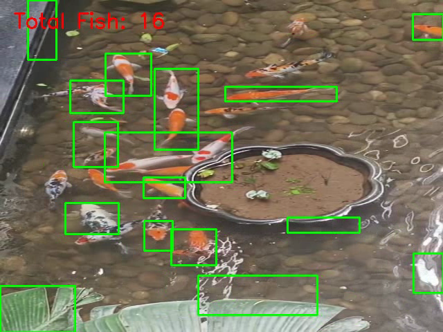

# Fish Tracking Project

This project demonstrates fish tracking in a pond using computer vision techniques with OpenCV. The script processes the video `fish_pond.mp4` and generates an output video `output.mp4` showing the tracking results.

## Features
- Detects and tracks fish in a video.
- Outputs a processed video with tracking overlays.

## How to Run
1. Install dependencies:
   ```bash
   pip install opencv-python
   ```
2. Run the script:
   ```bash
   python fish_tracking.py
   ```

## Output Example
Below is an example frame from the output video:



---

Feel free to use or modify this project for your own fish tracking experiments!
